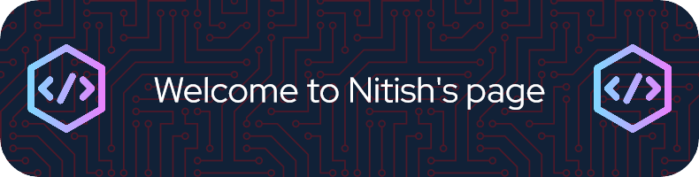

<!---
DevMindNit/DevMindNit is a ✨ special ✨ repository because its `README.md` (this file) appears on your GitHub profile.
You can click the Preview link to take a look at your changes.
--->

# 💫 About Me:
Hey, you found my profile!  I'm Nitish, an enthusiastic software developer who thrives on coding adventures in C++ and Python. With a passion for innovation and a drive to learn, I'm constantly seeking out new challenges to expand my skills and push the boundaries of what's possible in the world of technology.  Currently, I'm living the dream as a software developer, where I get to tackle exciting projects that make a real difference. From optimizing performance to developing cutting-edge solutions, I'm always ready to dive headfirst into the next big challenge!  When I'm not busy coding, you'll find me soaking up the sunshine outdoors, experimenting with wild new recipes in the kitchen, or losing myself in the pages of a thrilling book. I believe in living life to the fullest and bringing that same energy and enthusiasm to everything I do, both inside and outside of coding.  Feel free to reach out if you're interested in collaborating on exciting projects or simply want to connect. Let's code something awesome together! 💻✨

## 🌐 Socials:
 

# 💻 Tech Stack:
          
# 📊 GitHub Stats:
 
 

## 🏆 GitHub Trophies

### ✍️ Random Dev Quote

### 😂 Random Dev Meme

---

